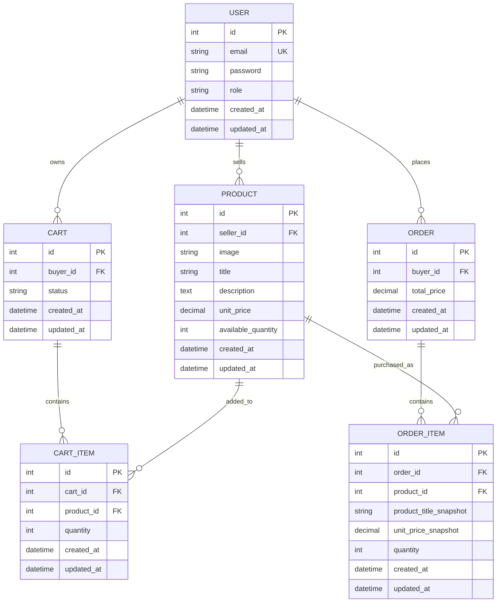

# StoreFront Management System ER Diagram

This document defines the Phase 1 database design for the StoreFront Management System.

## Architecture Defaults

- Backend: Django + Django REST Framework
- Frontend: React + TypeScript
- Authentication: JWT access and refresh tokens
- Database: SQLite by default
- Media: local product image upload

## Entity Relationship Diagram

## Tables

### User

Stores account credentials and role-based access information.

| Field | Type | Constraint | Notes |
| --- | --- | --- | --- |
| `id` | Integer | Primary key | Auto-generated |
| `email` | String | Unique, required | Used for login |
| `password` | String | Required | Stored as Django password hash |
| `role` | String | Required | Either `seller` or `buyer` |
| `created_at` | DateTime | Required | Auto-generated |
| `updated_at` | DateTime | Required | Auto-updated |

### Product

Stores seller-created product listings.

| Field | Type | Constraint | Notes |
| --- | --- | --- | --- |
| `id` | Integer | Primary key | Auto-generated |
| `seller_id` | Integer | Foreign key to `User.id` | Must reference a seller |
| `image` | URL string | Required | UploadThing public URL |
| `title` | String | Required | Product name |
| `description` | Text | Required | Product details |
| `unit_price` | Decimal | Required | Must be greater than 0 |
| `available_quantity` | Integer | Required | Must be 0 or greater |
| `created_at` | DateTime | Required | Auto-generated |
| `updated_at` | DateTime | Required | Auto-updated |

### Cart

Stores buyer shopping carts.

| Field | Type | Constraint | Notes |
| --- | --- | --- | --- |
| `id` | Integer | Primary key | Auto-generated |
| `buyer_id` | Integer | Foreign key to `User.id` | Must reference a buyer |
| `status` | String | Required | `active` or `checked_out` |
| `created_at` | DateTime | Required | Auto-generated |
| `updated_at` | DateTime | Required | Auto-updated |

Implementation rule: use one active cart per buyer. Once checkout succeeds, mark the cart as `checked_out` and create a new active cart only when the buyer adds another item later.

### CartItem

Stores products and quantities inside a buyer cart.

| Field | Type | Constraint | Notes |
| --- | --- | --- | --- |
| `id` | Integer | Primary key | Auto-generated |
| `cart_id` | Integer | Foreign key to `Cart.id` | Required |
| `product_id` | Integer | Foreign key to `Product.id` | Required |
| `quantity` | Integer | Required | Must be greater than 0 |
| `created_at` | DateTime | Required | Auto-generated |
| `updated_at` | DateTime | Required | Auto-updated |

Constraint: `cart_id` and `product_id` should be unique together so the same product appears once per cart.

### Order

Stores finalized buyer checkout records.

| Field | Type | Constraint | Notes |
| --- | --- | --- | --- |
| `id` | Integer | Primary key | Auto-generated |
| `buyer_id` | Integer | Foreign key to `User.id` | Must reference a buyer |
| `total_price` | Decimal | Required | Sum of all order items |
| `created_at` | DateTime | Required | Auto-generated |
| `updated_at` | DateTime | Required | Auto-updated |

### OrderItem

Stores finalized purchased products.

| Field | Type | Constraint | Notes |
| --- | --- | --- | --- |
| `id` | Integer | Primary key | Auto-generated |
| `order_id` | Integer | Foreign key to `Order.id` | Required |
| `product_id` | Integer | Foreign key to `Product.id` | Required |
| `product_title_snapshot` | String | Required | Copied from product at checkout |
| `unit_price_snapshot` | Decimal | Required | Copied from product at checkout |
| `quantity` | Integer | Required | Must be greater than 0 |
| `created_at` | DateTime | Required | Auto-generated |
| `updated_at` | DateTime | Required | Auto-updated |

Snapshot fields keep order history accurate after a seller edits product title or price.

## Data Integrity Rules

- Only users with role `seller` can own products.
- Only users with role `buyer` can own carts and orders.
- Product `unit_price` must be greater than 0.
- Product `available_quantity` must be 0 or greater.
- Cart item `quantity` must be greater than 0.
- Order item `quantity` must be greater than 0.
- Checkout must run inside a database transaction.
- Checkout must reject any cart item whose quantity exceeds current product stock.
- Product inventory must never become negative.
- Order item title and unit price snapshots must not change when the product changes later.
